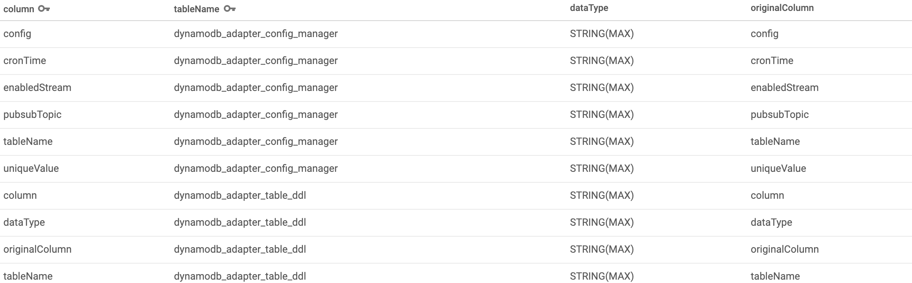

# dynamodb-adapter

[](https://gitter.im/cloudspannerecosystem/dynamodb-adapter?utm_source=badge&utm_medium=badge&utm_campaign=pr-badge&utm_content=badge)

Work in progress -- please check back later!

## Introduction
Dynamodb-adapter is an API tool which translates the AWS Dynamodb queries to Cloud Spanner equivalent queries and runs those queries on Cloud Spanner. By running this project locally or on cloud, this would work seemlessly.

Additionally, It also support the primary index and secondary index in similar way as dynamodb supports.

It will be helpful for moving to the Spanner from dynamodb environment without changing the code of dynamodb. APIs created by this project can be directly consumed at place of dynamodb queries.

This project require two tables to store metadata and configuation for the project.
* dynamodb_adapter_table_ddl (for meta data of all tables)
* dynamodb_adapter_config_manager (for pubsub configuation)

It supports two mode  - 
* Production
* Staging

## Usage
Follow the given steps to setup the project and generate the apis.

### 1. Creation for the Base Tables in Spanner
#### Table: dynamodb_adapter_table_ddl
This table will be used to store the metadata for other tables.
```
CREATE TABLE 
dynamodb_adapter_table_ddl 
(
 column		    STRING(MAX),
 tableName	    STRING(MAX),
 dataType 	    STRING(MAX),
 originalColumn     STRING(MAX),
) PRIMARY KEY (tableName, column)
```

Put the sample data and all other table's metadata 



#### Table: dynamodb_adapter_config_manager
This table will be used to store the configuration info for publishing the data in pubsub topic for other processes on change of data.

```
CREATE TABLE 
dynamodb_adapter_config_manager 
(
 tableName 	STRING(MAX),
 config 	STRING(MAX),
 cronTime 	STRING(MAX),
 enabledStream 	STRING(MAX),
 pubsubTopic    STRING(MAX),
 uniqueValue    STRING(MAX),
) PRIMARY KEY (tableName)
```


### 2. Creation for configuration files
There are two folders in [config-files](./config-files). 
* **production** : for prodcution environment
* **staging** : for development environment 

Add the configuration in the given files:
#### config.{env}.json 
| Key | Used For |
| ------ | ------ |
| GOOGLE_PROJECT_ID | Your Google Project ID |
| SPANNER_DB | Your Spanner Database Name |

For example:
```
{
    "GOOGLE_PROJECT_ID" : "first-project",
    "SPANNER_DB"        : "test-db"
}
```

#### spanner.{env}.json
All table's instance-id will be stored in this file in this format: 
"TableName" : "instance-id"

For example:

```
{
    "dynamodb_adapter_table_ddl": "spanner-2 ",
    "dynamodb_adapter_config_manager": "spanner-2",
    "tableName1": "spanner-1",
    "tableName2": "spanner-1"
}
```

#### tabels.{env}.json
All table's primary key, columns, index information will be stored here.

| Key | Used For |
| ------ | ------ |
| tableName | table name present in dbynamo db |
| paritionKey | Primary key |
| sortKey| Sorting key |
| attributeTypes | Coulmn names and type present |
| indices | indexes present in the table |


For example:

```
{
    "tableName":{
        "partitionKey":"primary key or Partition key",
        "sortKey": "sorting key of dynamoDB adaptar",
        "attributeTypes": {
			"ColmnnName1": "Type of like N & S for ColmnnName1",
			"ColmnnName2": "Type of like N & S for ColmnnName2"
        },
        "indices": { 
			"indexName1": {
				"sortKey": "sort key indexName1",
				"partitionKey": "partition key for indexName1"
			}
		}
    }
}
```


### 3. Creation of rice-box.go file
##### install rice package

```
go get github.com/GeertJohan/go.rice
go get github.com/GeertJohan/go.rice/rice
```
##### run command for creating the file.
This is required to increase the performance when any config file is changed so that configuration files can be loaded directly from go file.
```
rice embed-go
```

### 4. Run 
* Setup GCP project on **gcloud cli** 

* Run for **staging**
    ```
    go run main.go
    ```
* Run for **Production**
    ```
    export ACTIVE_ENV=PRODUCTION
    go run main.go
    ```

