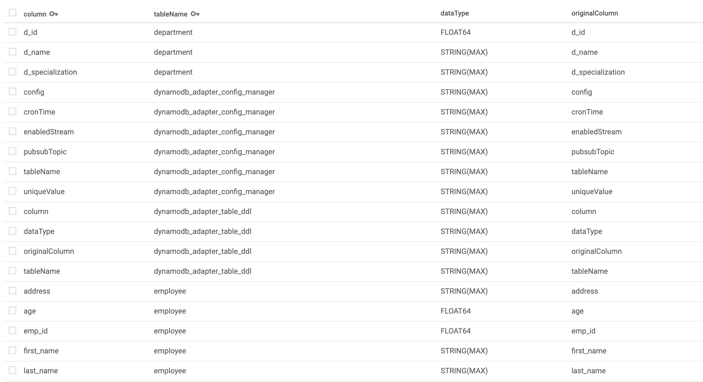

# DynamoDB Adapter

[](https://gitter.im/cloudspannerecosystem/dynamodb-adapter?utm_source=badge&utm_medium=badge&utm_campaign=pr-badge&utm_content=badge)

[](https://circleci.com/gh/cloudspannerecosystem/dynamodb-adapter)

## Introduction

DynamoDB Adapter is a tool that translates AWS DynamoDB queries to Cloud
Spanner equivalent queries and runs those queries on Cloud Spanner. The
adapter serves as a proxy whereby applications that use DynamoDB can send their
queries to the adapter where they are then translated and executed against
Cloud Spanner. DynamoDB Adapter is helpful when moving to Cloud Spanner from
a DynamoDB environment without changing the code for DynamoDB queries. The APIs
created by this project can be directly consumed where DynamoDB queries are
used in your application.

The adapter supports the basic data types and operations required for most
applications.  Additionally, it also supports primary and secondary indexes in
a similar way as DynamoDB. For detailed comparison of supported operations and
data types, refer to the [Compatibility Matrix](#compatibility_matrix)

## Examples and Quickstart

The adapter project includes an example application and sample eCommerce
data model. The [instructions](./examples/README.md) for the sample
application include migration using [Harbourbridge](https://github.com/cloudspannerecosystem/harbourbridge)
and [setup](./examples/README.md#initialize_the_adapter_configuration) for
the adapter.

## Compatibility Matrix

### Supported Actions

DynamoDB Adapter currently supports the folowing operations:

| DynamoDB Action
|----------------
| BatchGetItem
| BatchWriteItem
| DeleteItem
| GetItem
| PutItem
| Query
| Scan
| UpdateItem

### Supported Data Types

DynamoDB Adapter currently supports the following DynamoDB data types

| DynamoDB Data Type            | Spanner Data Types
| ------------------------------| ------------------
| `N` (number type)             | `INT64`, `FLOAT64`, `NUMERIC`
| `BOOL` (boolean)              | `BOOL`
| `B` (binary type)             | `BYTES(MAX)`
| `S` (string and data values)  | `STRING(MAX)`

## Configuration

DynamoDB Adapter requires two tables to store metadata and configuration for
the project: `dynamodb_adapter_table_ddl` and
`dynamodb_adapter_config_manager`. There are also three configuration files
required by the adapter: `config.json`, `spanner.json`, `tables.json`.

By default there are two folders **production** and **staging** in
[config-files](./config-files). This is configurable by using the enviroment
variable `ACTIVE_ENV` and can be set to other environment names, so long as
there is a matching directory in the `config-files` directory. If `ACTIVE_ENV`
is not set the default environtment is **staging**.

### dynamodb_adapter_table_ddl

`dynamodb_adapter_table_ddl` stores the metadata for all DynamoDB tables now
stored in Cloud Spanner. It is used when the adapter starts up to create a map
for all the columns names present in Spanner tables with the columns of tables
present in DynamoDB. This mapping is required because DynamoDB supports the
special characters in column names while Cloud Spanner only supports
underscores(_). For more: [Spanner Naming Conventions](https://cloud.google.com/spanner/docs/data-definition-language#naming_conventions)

```sql
CREATE TABLE
dynamodb_adapter_table_ddl
(
 column         STRING(MAX),
 tableName      STRING(MAX),
 dataType       STRING(MAX),
 originalColumn STRING(MAX),
) PRIMARY KEY (tableName, column)
```



### dynamodb_adapter_config_manager

`dynamodb_adapter_config_manager` contains the Pub/Sub configuration used for
DynamoDB Stream compatability. It is used to do some additional operation
required on the change of data in tables. It can trigger New and Old data on
given Pub/Sub topic.

```sql
CREATE TABLE
dynamodb_adapter_config_manager
(
 tableName      STRING(MAX),
 config         STRING(MAX),
 cronTime       STRING(MAX),
 enabledStream  STRING(MAX),
 pubsubTopic    STRING(MAX),
 uniqueValue    STRING(MAX),
) PRIMARY KEY (tableName)
```

### config-files/{env}/config.json

`config.json` contains the basic settings for DynamoDB Adapter; GCP Project,
Cloud Spanner Database and query record limit.

| Key               | Description |
| ----------------- | -----------
| GoogleProjectID   | Your Google Project ID |
| SpannerDb         | Your Spanner Database Name |
| QueryLimit        | Default limit for the number of records returned in query |

For example:

```json
{
    "GoogleProjectID"   : "first-project",
    "SpannerDb"         : "test-db",
    "QueryLimit"        : 5000
}
```

### config-files/{env}/spanner.json

`spanner.json` is a key/value mapping file for table names with a Cloud Spanner
instance ids. This enables the adapter to query data for a particular table on
different Cloud Spanner instances.

For example:

```json
{
    "dynamodb_adapter_table_ddl": "spanner-2 ",
    "dynamodb_adapter_config_manager": "spanner-2",
    "tableName1": "spanner-1",
    "tableName2": "spanner-1"
    ...
    ...
}
```

### config-files/{env}/tables.json

`tables.json` contains the description of the tables as they appear in
DynamoDB. This includes all table's primary key, columns and index information.
This file supports the update and query operations by providing the primary
key, sort key and any other indexes present.

| Key               | Description |
| ----------------- | -----------
| tableName         | Name of the table in DynamoDB |
| partitionKey      | Primary key of the table in DynamoDB |
| sortKey           | Sorting key of the table in DynamoDB |
| attributeTypes    | Key/Value list of column names and type |
| indices           | Collection of index objects that represent the indexes present in the DynamoDB table |

For example:

```json
{
    "tableName": {
        "partitionKey": "primary key or Partition key",
        "sortKey": "sorting key of dynamoDB adapter",
        "attributeTypes": {
            "column_a": "N",
            "column_b": "S",
            "column_of_bytes": "B",
            "my_boolean_column": "BOOL"
        },
        "indices": {
            "indexName1": {
                "sortKey": "sort key for indexName1",
                "partitionKey": "partition key for indexName1"
            },
            "another_index": {
                "sortKey": "sort key for another_index",
                "partitionKey": "partition key for another_index"
            }
        }
    },
    .....
    .....
}
```

## Starting DynamoDB Adapter

Complete the steps described in
[Set up](https://cloud.google.com/spanner/docs/getting-started/set-up), which
covers creating and setting a default Google Cloud project, enabling billing,
enabling the Cloud Spanner API, and setting up OAuth 2.0 to get authentication
credentials to use the Cloud Spanner API.

In particular, ensure that you run

```sh
gcloud auth application-default login
```

to set up your local development environment with authentication credentials.

Set the GCLOUD_PROJECT environment variable to your Google Cloud project ID:

```sh
gcloud config set project [MY_PROJECT NAME]
```

```sh
export ACTIVE_ENV=PRODUCTION
go run main.go
```

### Internal Startup Stages

When DynamoDB Adapter starts up the following steps are performed:

*   Stage 1 - Configuration is loaded according the Environment Variable
    *ACTIVE_ENV*
*   Stage 2 - Connections to Cloud Spanner instances are initialized.
    Connections to all the instances are started it doesn't need to start the
    connection again and again for every request.
*   Stage 3 - `dynamodb_adapter_table_ddl` is parsed and will stored in ram for
    faster access of data.
*   Stage 4 - `dynamodb_adapter_config_manager` is loaded into ram. The adapter
    will check every 1 min if configuration has been changed, if data is changed
    it will be updated in memory.
*   Stage 5 - Start the API listener to accept DynamoDB operations.

## Advanced

### Embedding the Configuration

The rice-box package can be used to increase preformance by converting the
configuration files into Golang source code and there by compiling them into
the binary.  If they are not found in the binary rice-box will look to the
disk for the configuration files.

#### Install rice package

This package is required to load the config files. This is required in the
first step of the running DynamoDB Adapter.

Follow the [link](https://github.com/GeertJohan/go.rice#installation).

#### run command for creating the file

This is required to increase the performance when any config file is changed
so that configuration files can be loaded directly from go file.

```sh
rice embed-go
```

## API Documentation

This is can be imported in Postman or can be used for Swagger UI.
You can get open-api-spec file here [here](https://github.com/cldcvr/dynamodb-adapter/wiki/Open-API-Spec)
